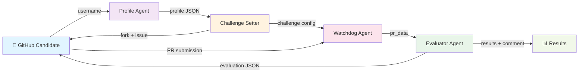
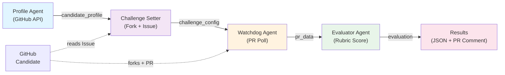

# GitAgent Interviewer

**Autonomous technical hiring via GitHub. No resumes. No LeetCode. Just live pull request evaluation.**

GitAgent Interviewer is a multi-agent system that conducts real technical interviews by having candidates fix actual bugs under a 60-minute time constraint. The system evaluates code quality, problem-solving approach, and shipping ability through an objective rubric.

## Problem & Solution

**Challenge:** Traditional hiring is slow, biased, and doesn't measure shipping ability.

**Solution:** Use GitHub as the interview platform. Real candidates, real code, real time pressure. The 4-agent system orchestrates the entire flow autonomously.

## Why This Approach?

- ✅ **Objective:** Score based on actual code, not vibes
- ✅ **Scalable:** Run interviews 24/7 without human moderators
- ✅ **Fair:** Same challenge, same time, same rubric for everyone
- ✅ **Verifiable:** Full audit trail, commit history, PR timeline
- ✅ **Fast:** 4 agents handle everything in ~5 minutes for demo mode

## How It Works

The interview pipeline consists of 4 autonomous agents:

1. **Profile Agent** — Fetches the candidate's GitHub history and infers skill level
2. **Challenge Setter** — Creates a forked challenge repository with intentional bugs and opens a GitHub Issue with clear requirements
3. **Watchdog Agent** — Polls the fork for a Pull Request and enforces the 60-minute submission window
4. **Evaluator Agent** — Scores the PR submission against a comprehensive rubric and posts detailed feedback

Each agent runs autonomously without human intervention. The entire pipeline is logged and results are saved as structured JSON for reproducibility and analysis.

## Architecture



## Evaluation Rubric

The Evaluator Agent scores submissions on a **100-point scale** across 5 dimensions:

| Dimension | Points | What We Measure |
|-----------|--------|-----------------|
| **Correctness** | 0-30 | Did you fix all bugs? Any regressions? |
| **Code Quality** | 0-25 | Readability, style, adherence to best practices |
| **Edge Cases** | 0-20 | Null checks, boundary conditions, error handling |
| **Approach** | 0-15 | Solution elegance, minimal changes, clear logic |
| **Commit Clarity** | 0-10 | Meaningful messages, atomic commits |

**Verdicts:**
- **85+**: Strong Hire 🌟
- **75-84**: Hire ✅
- **60-74**: Consider 🤔
- **<60**: No Hire ❌

The Evaluator uses **Google Gemini AI** to analyze diffs and generate explanations, but includes a heuristic fallback if the API is unavailable.

## Setup

### Prerequisites
- Python 3.11+
- GitHub account with Personal Access Token (create at https://github.com/settings/tokens with `repo` and `read:user` scopes)
- Google Gemini API key (create at https://aistudio.google.com)

### Installation

```bash
git clone https://github.com/lyzr-ai/gitagent-interviewer.git
cd gitagent-interviewer

pip install -r requirements.txt

cp .env.example .env
# Edit .env and add your GITHUB_TOKEN
```

### Configuration

Edit `.env` with your credentials:

```env
GITHUB_TOKEN=ghp_xxxxxxxxxxxxx  # Your GitHub Personal Access Token
GEMINI_API_KEY=AIza_xxxxxxxxxxxxx  # Your Google Gemini API key
GITHUB_USERNAME=your_username    # Your GitHub username
```

## Usage

### Run a single interview

```bash
python main.py <github_username>
```

Example:
```bash
python main.py torvalds
```

The system will:
1. Build a profile of the candidate from their GitHub history
2. Fork a challenge template (junior or senior based on skill level)
3. Create a GitHub Issue in the fork with task instructions
4. Wait up to 60 minutes for a PR submission
5. Score the PR and post evaluation results
6. Save results to `results/{username}_{timestamp}.json`

### Run the demo

```bash
python demo.py [username]
```

This runs the complete pipeline on a hardcoded username (default: `torvalds`) with a shortened polling interval for testing. Shows all agent outputs and generates sample evaluation results.

## Example Output

### Profile Agent
```json
{
  "username": "torvalds",
  "skill_level": "senior",
  "top_languages": ["C", "Shell", "Python"],
  "frameworks": [],
  "activity_score": 0.45,
  "public_repos_count": 47,
  "estimated_years_experience": 30.5
}
```

### Challenge Setter
```json
{
  "fork_url": "https://github.com/torvalds/gitagent-challenge-senior",
  "issue_number": 1,
  "challenge_template": "challenge_senior",
  "time_limit_minutes": 60,
  "status": "ready"
}
```

### Evaluator Result
```json
{
  "verdict": "strong hire",
  "score_breakdown": {
    "correctness": 28,
    "code_quality": 22,
    "edge_cases": 19,
    "approach": 14,
    "commit_clarity": 9,
    "total": 92
  },
  "feedback": "Excellent submission. You identified all three bugs and fixed them cleanly..."
}
```

### PR Comment

```markdown
## GitAgent Interviewer — Evaluation Report

**Candidate:** @torvalds
**Challenge:** challenge_senior
**Time taken:** 45 minutes
**Verdict:** strong hire

### Score breakdown
| Dimension | Score | Max |
|-----------|-------|-----|
| Correctness | 28 | 30 |
| Code quality | 22 | 25 |
| Edge case handling | 19 | 20 |
| Approach & reasoning | 14 | 15 |
| Commit clarity | 9 | 10 |
| **Total** | **92** | **100** |

### Feedback
Excellent submission...
```

## Architecture



## Challenge Templates

### Junior/Mid Level: `calculate_stats`

Fix three bugs in a Python function:
- **Bug 1:** Off-by-one error in average calculation
- **Bug 2:** Wrong comparison operator in max detection
- **Bug 3:** Missing null check for empty list

### Senior Level: Flask `/transfer` Endpoint

Fix three bugs in a Flask API:
- **Bug 1:** Race condition (atomic transaction missing)
- **Bug 2:** Missing authentication check
- **Bug 3:** Incorrect test mock that hides the bugs

## Evaluation Rubric

Each submission is scored on 5 dimensions:

| Dimension | Max | Criteria |
|-----------|-----|----------|
| **Correctness** | 30 | All bugs fixed? Tests pass? |
| **Code Quality** | 25 | Clean code? Follows style? |
| **Edge Cases** | 20 | Handles nulls, boundaries, errors? |
| **Approach** | 15 | Elegant or brute force? Shows understanding? |
| **Commit Clarity** | 10 | Clear messages? Good PR description? |

**Verdict:**
- **Strong hire** (85-100): Mastery. Ships clean code under pressure.
- **Hire** (75-84): Solid fundamentals. Productive immediately.
- **Consider** (60-74): Promise with gaps. Needs mentorship.
- **No hire** (<60): Doesn't meet the bar.

## Project Structure

```
gitagent-interviewer/
├── agent.yaml              # GitAgent configuration
├── SOUL.md                 # Agent values and purpose
├── RULES.md                # Operational rules
├── skills/                 # Agent skill definitions
│   ├── profile.md
│   ├── challenge.md
│   ├── watchdog.md
│   └── evaluator.md
├── tools/                  # Python utilities
│   ├── github_api.py       # GitHub API client
│   ├── poll_pr.py          # PR polling logic
│   └── scorer.py           # Evaluation scoring
├── templates/              # Challenge templates
│   ├── challenge_junior/
│   │   ├── main.py
│   │   └── test_main.py
│   └── challenge_senior/
│       ├── app.py
│       └── test_app.py
├── memory/                 # Candidate history
│   └── candidates.md
├── results/                # Output directory
├── hooks/                  # Session end handler
├── main.py                 # CLI entry point
├── demo.py                 # Demo script
├── requirements.txt        # Python dependencies
├── .env.example            # Configuration template
└── README.md               # This file
```

## How to Interpret Results

### High-Scoring Submission (85+)
- All bugs fixed correctly
- Clean, readable code
- Thoughtful edge case handling
- Clear commit messages explaining the approach
- Would merge immediately in a real review

### Mid-Scoring Submission (60-74)
- Most bugs fixed, maybe one issue remains
- Code works but has style issues
- Limited edge case consideration
- Adequate but minimal explanation
- Would need revision before merge

### Low-Scoring Submission (<60)
- Incomplete fixes or failing tests
- Unclear or messy code
- No edge case thinking
- Minimal commit clarity
- Does not meet hiring bar

## FAQ

**Can I use this for hiring?**
Yes. The rubric is objective and applies the same standard to every candidate. Results are reproducible and logged.

**What if the candidate doesn't submit a PR?**
The Watchdog Agent waits exactly 60 minutes. If no PR is submitted, the challenge is marked incomplete and the issue is closed.

**What if the candidate submits multiple PRs?**
Only the first PR (by creation time) is evaluated. Additional PRs are ignored.

**Can I use different challenge templates?**
Yes. You can create new templates and register them in the Challenge Setter agent. Templates should include a broken implementation and tests that expose the bugs.

**How are results stored?**
All results are saved as JSON to the `results/` directory:
- `{username}_{timestamp}.json` — Full pipeline result
- `{username}_{timestamp}_evaluation.json` — Detailed evaluation
- `{username}_{timestamp}_logs.txt` — System logs

**Does this require AI/Claude?**
The current version uses deterministic heuristics for evaluation. Integration with Claude (claude-sonnet-4-20250514) is planned for more nuanced code understanding.

## Security & Privacy

- Only public GitHub data is fetched
- No code is stored locally except for evaluation
- Results are saved locally; GitHub Issues/PRs are visible to the candidate
- The system does not send code to external services (except GitHub's own APIs)

## Limitations

- Junior challenge is Python-only; Senior challenge is Flask-only
- Evaluation uses heuristic scoring, not ML-based code analysis
- Does not run tests directly (would require sandboxing)
- GitHub API rate limits apply (5000 requests/hour)

## Contributing

To add new challenge templates or improve the rubric:

1. Create a new template in `templates/challenge_{type}/`
2. Include intentional bugs and a test suite
3. Update the Challenge Setter to recognize the template
4. Update the Evaluator rubric if needed

## License

MIT License. See LICENSE for details.

## Built With

- **PyGithub** — GitHub API client
- **Google Generative AI** — Gemini API for evaluation
- **Flask** — Test challenge framework
- **pytest** — Test runner

---

**GitAgent Interviewer** — Built for Lyzr AI | Open GitAgent Standard | Evaluating engineers since 2026
"# lyzr-" 
